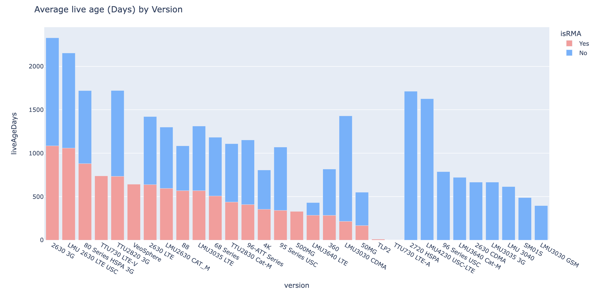

## Predictive detection of RMA devices 

**John Ruiz**

### Executive summary

Let us start from the concept of RMA: RMA stands for Return Merchandise Authorization. It's a formal agreement between a seller (usually a retailer) and a customer that allows the return of a product.

In many businesses, the RMA process is something that could generate unexpected expenses since it generally involves the replacement of a product, at the same time that the customer could have a bad experience when using the service or product. Specifically in our GPS tracking business, this is no different. I will focus on the world of GPS devices to predict when devices can go through the RMA process by exploring the malfunction warnings collected.

### Rationale
From business perspective it is relevant keeping all customers happy with the product they are getting from a company like us. Considering this is a GPS tracking company, the good performance of the devices installed in each vehicle is essential to fulfill this promise.

### Research Question

How can we predict whether or not a GPS device shows bad behavior to proactively initiate an RMA process and prevent the customer from having a bad experience when tracking their vehicles?

### Data Sources

The analysis will be based on 3 different files consisting of:

- [devices_active.csv](data/devices_active.csv): This file consist of 2000 records containing information for active devices working as expected.
- [devices_rma.csv](data/devices_rma.csv): It consist of 647 records with devices processed as RMA. In order to mark those devices as RMA, this was necessary to perform a sequence of thoubleshoting steps.
- [troubleshooting_cases.xlsx](data/troubleshooting_cases.xlsx): This is a generated report from "Sales Force" platform where are registered cases reported by our customers. Some cases are related to devices by including the ESN or IMEI.

### Attribute Information:

#### **devices_active.csv & devices_rma.csv structure**

*Those files contains the same structure*

- companyId: Internal identifier for the account related with the devices
- unitId: Device identifier
- imei: IMEI registered in the system for this devices
- esn: Serial number
- manufacturer: Name of the manufacturer
- unitType: Classification for the device
- version: Devices model
- isRMA: Boolean indicating if device is marked as RMA
- liveAgeDays: Duration in days for the devices being active in the platform
- HDOPQuality: Average events received with HDOPQuality > 2
- ExcessiveEvents: Average events received at server level from device. This evaluates the - maximum events the device is supposed to transmit
- LowBattery: Average events received at server level identified as "low battery"
- IgnitionOnEventsAbnormal: When a device reports more than 50 times per day and the ignitions received is higher than 15% of total. This is an average value.
- PowerDisconnect: Average events received at server level identified as "power disconnected"
- LowSatellites: Average occurencies When this has being determined the amount of low satellites is present more than 15% of total events.
- DailyOdometerExceeded: Average accumulated distance (Odometer in miles) reported exceeding a distance considering average speed for a vehicle
- WirelessSignal: When the average signal strengh is lower than 10. This is an average.
- MaintenanceLimitExceeded: This is an event generated for devices where the manufacturer is "Calamp". Refers to an event generated when device is reporting the same event more than 100 times during a day. This is a average of occurrences for this event
- LateEvents: When the events arriving late to server is higher than 10% compared with the - total events. This is an average.
- CommLost: This is a percentage, validating when commLost events are greater than 10% of total events received
- DailyEngineHoursExceeded: When this is detected the engineHours reported are higher than 24 hours. This is an average of the engine hours reported

#### **troubleshooting_cases.xlsx**
*From this file, we are interested to count the occurrencies of a device being reported in cases. We'll be looking for the totalCases.*

- PM Account ID: Identifier of this account over the internal company's platform manager
- IMEI / SN: Included the serial or IMEI of devices included into the case
- Account Name: Name of the account in our platform
- Subject: Title for the case
- Case Number: Auto generated value from SalesForce identifying the case
- Status: Current status for the case
- Number of Devices Impacted: Devices with the same situation reported in the case
- Category: Classification for the case
- SubCategory: Subclassification for the case
- Return Status: Used to trace when devices must be returned to us. This shows the status of return
- Open: Boolean: Boolean indicator when case is opened
- Closed: Boolean indicator when case is closed

### Methodology

1. Collect dataset from client databases including maintenance warnings generated per device.
2. Collect dataset from client databases including the list of devices marked as RMA including the maintenance warnings generated by those devices.
3. Export data from Sales Force including the cases related to devices.
4. Generate an unified dataset with the combination of the 3 mentioned above. The final dataset shows active devices, rma devices and the total cases reported by each device.
5. Lookup for missed data over the unified dataset and fill gaps accordingly. Disregards the unnecessary information.
6. Idenfity the baseline by using a Dummy Classifier to know what are the minimum performance expected over the trained model.
7. Perform a comparison of different classification models including: KNeighborsClassifier, DecisionTreeClassifier, SVC, LogisticRegression, One vs. Rest, Oversampling. looking for the model with best performance.
8. Since RMA devices vs. active devices are imbalanced, we will include an "oversampling" technique into comparisons.

### Data Preparation

#### Missed values for devices dataset

Once the devices_active and devices_rma dataset are concatenated, this is identified some missed `imei`s. This is know internally the system could use ESN or IME as identified over GPS Tracking devices. For this reason, we'll be filling those empty spaces when the ESN value.

#### Re-evaluating missed values after cleanup

Once the missed IMEIs has being updated with the ESN, this is evaluating the missed values using a heatmap graph again:

#### Proportion of RMA devices over the devices dataset

The following shows the data balances for active vs devices processed as RMA. This is an imbalanced dataset.

#### Correlation between features included in dataset

We'll be removing some features with high correlation and the identifiers columns like: companyId, unitId, imei, esn. Manufacturer and unitType will be remove as this is correlated with version.

#### Evaluating best model
 

Based on the above results, the best model fitting the dataset provided is the `KNeighborsClassifier`. I'll be using this model to predict the target column `isRMA`.

### Results

#### Feature Importance

Based on the above graph this is identified the following features are the most important when predicting isRMA (Top 4):

- liveAgeDays
- HDOPQuality
- IgnitionOnEventsAbnormal
- totalCases

The liveAgeDays is an indicator of natural wear and tear on devices. Over time, electronic components, vehicle vibration and other factors can affect GPS device performance. Considering this attribute, the company should review any replacement policies (Warranty) to avoid incurring in extra cost by assuming it.

Devices presenting worse HDOP quality are subject to replacement or installation review. When the GPS signal is not accurate enough, the customer could have a bad experience when tracking vehicle's location. This is a critical factor as showns in the above results.

When the Ignition On/Off appears with high frequency over reports received from devices is a bad signal of device's performance. We could tackle this by evaluating devices where the ignition is NOT detected correctly, firmware with failures over GPS devices and others.

The total cases is when this has being detected by the account directly and escalating to us (GPS Provider) about issues found with device.

#### Feature analysis

##### Device version with higher RMAs reported

Devices labeles as `88` (Geometris) as presentign higher RMA over the datasource used for this exercise followed by `4K`, `LMU2630 CAT M`

##### RMA average time to live

The `liveAgeDays` indicator, the duration in days of the device's active state, is equivalent on average to `519 days`. This measure must be considered by the company to review the policies it offers to customers regarding device replacement.

##### What is the version with worse HDOPQuality?

Based on the above graph the TTU730 LTE A presents the worse HDOP quality. This should be considered to use an alternative option of hardware as replacement for this version on replacements and new sales in order to avoid bad customer experiences.

### Next steps
As next steps to improve the accuracy of this model we could add more features to the dataset. It is possible to add more `Maintenance Warnings` related to unexpected behavior. This is know there are more cases such as when the latitude and longitud didn't change between reports.  Additionally, this could be important to include reasons of RMA in order to include major analysis beneficial for the company.

### Outline of project

The following is the notebook used to perform analysis over the data mentioned above:

[MaintenanceWarnings.ipynb](MaintenanceWarnings.ipynb)

#### Contact and Further Information

**John Ruiz**\
Director of Software Engineering\
GPS Trackit Communications\
[www.gpstrackit.com](https://www.gpstrackit.com)\
Email: jaruiz@tsomobile.com

